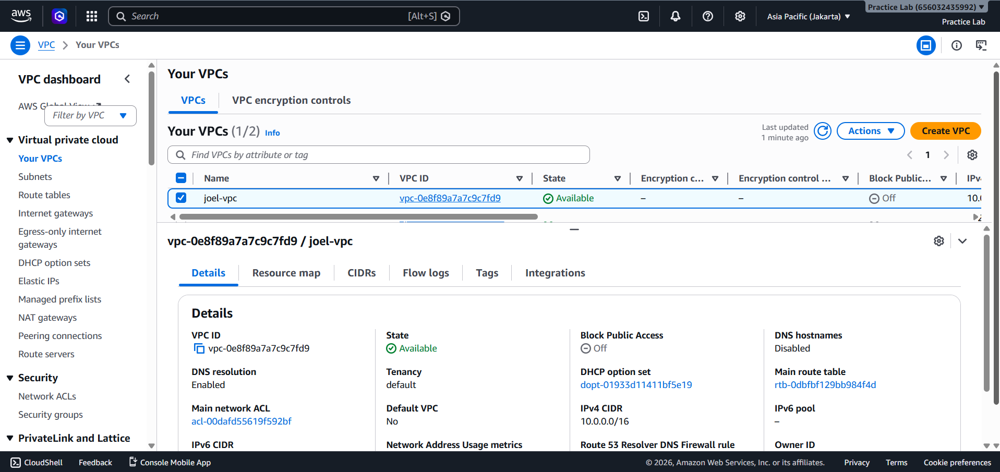
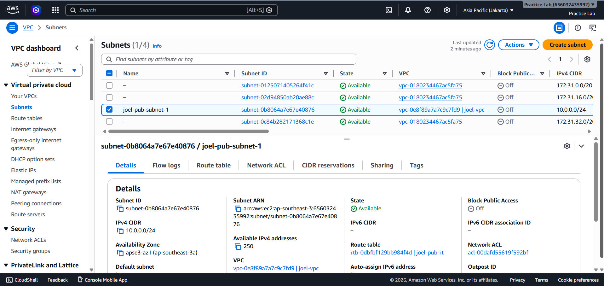
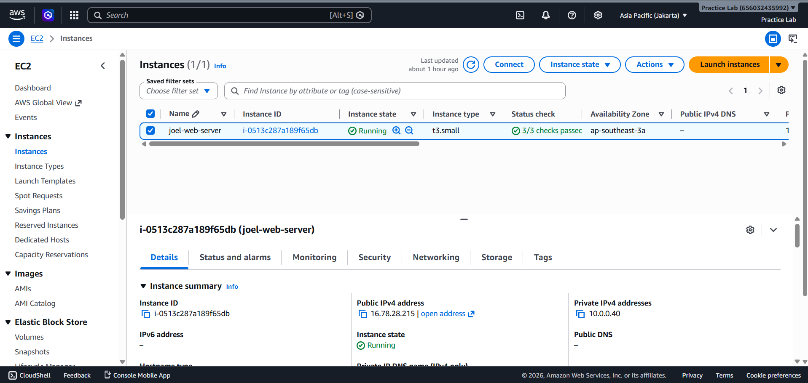
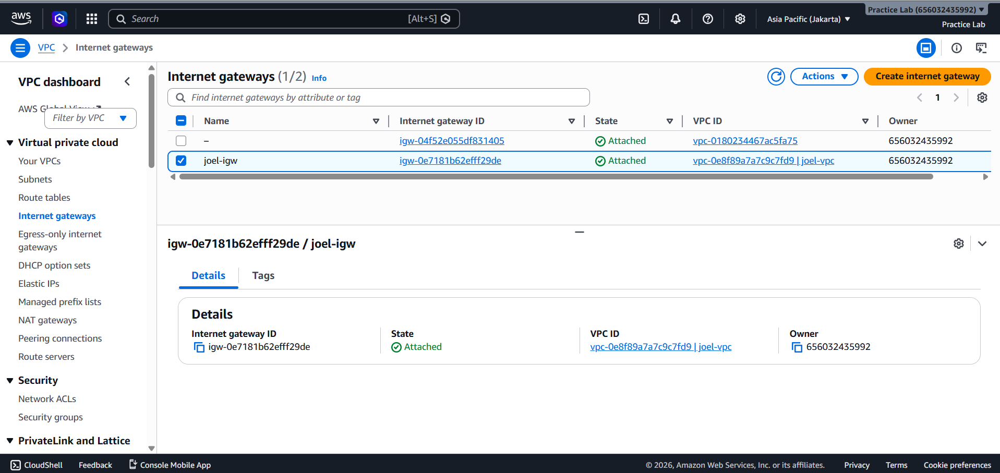
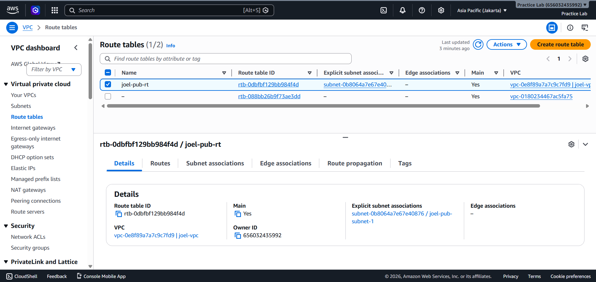
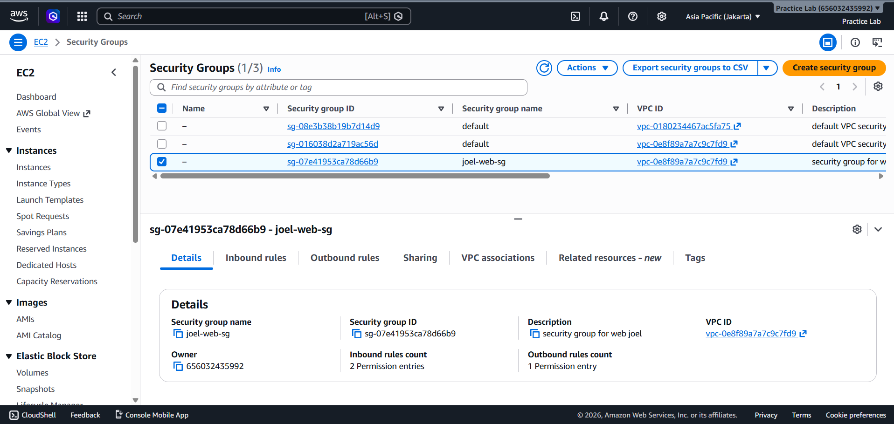
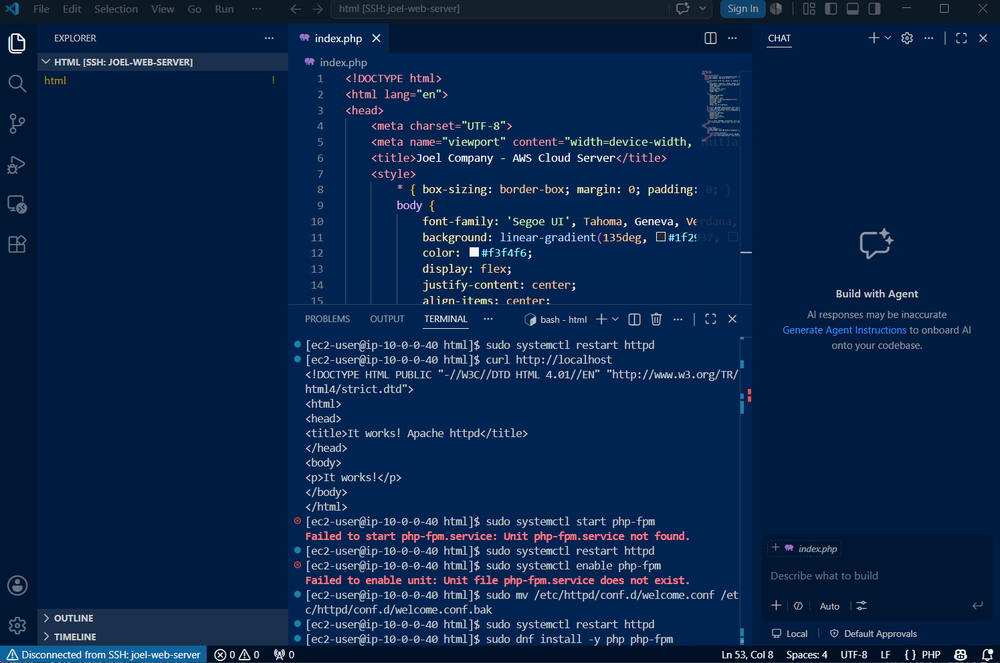
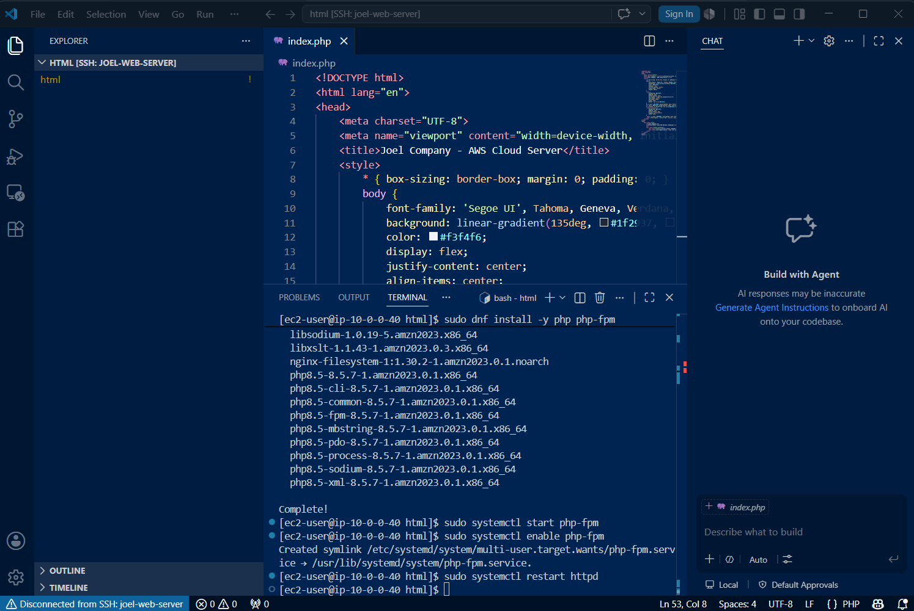
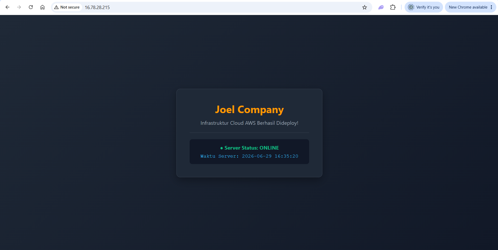
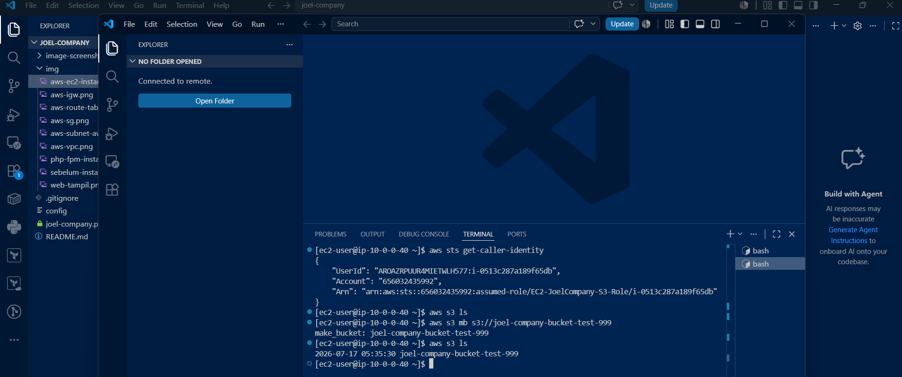

# 🌐 Joel Company: Enterprise Cloud Architecture Evolution

Repositori ini mendokumentasikan transformasi arsitektur cloud Joel Company dari tahap dasar (*Single-AZ EC2*) menuju arsitektur berskala industri (*Multi-AZ High Availability*) di Amazon Web Services (AWS).

## 🗺️ Roadmap Proyek
*   [Fase 1: Networking & Web Deployment]
    *   *Status: Completed* | VPC, EC2, SSH Access, Apache & PHP Deployment.
*   [Fase 2: Identity & Security (IAM)]
    *   *Status: Completed* | IAM Instance Profiles & Secure API Access.
*   Fase 3: Separasi Data & Database Relasional (RDS)
    *   *Status: Planned*
*   Fase 4: Backup & Lifecycle Management (S3/EBS)
    *   *Status: Planned*
*   Fase 5: Monitoring & Alerting (CloudWatch/SNS)
    *   *Status: Planned*
*   Fase 6: High Availability (Load Balancer & Multi-AZ)
    *   *Status: Planned*

---
*Proyek ini dirancang sebagai bukti latihan praktisi dalam mengelola infrastruktur cloud AWS.*
---
# Fase 1: Networking & Web Deployment
## Scene 1: AWS Core Infrastructure Provisioning

Pada tahap pertama ini, seluruh komponen jaringan dasar dan komputasi di AWS disiapkan untuk membangun pondasi server yang terisolasi dan aman.

### 1. Konfigurasi Jaringan & VM
- Membuat Virtual Private Cloud (VPC) kustom sebagai ruang terisolasi.

- Mengatur Subnet Publik agar server dapat menjangkau internet.

- Meluncurkan Amazon EC2 Instance dengan sistem operasi Amazon Linux 2023.

- Merancang Internet Gateway, Route Table, Security Group di AWS Console

---

## Scene 2: Secure Remote Access & SSH Connection

Setelah infrastruktur cloud aktif, tahap berikutnya adalah membangun koneksi remote yang aman dari perangkat lokal menggunakan protokol OpenSSH.

### 1. Masalah Keamanan Kunci Privat (.pem)
Saat mencoba melakukan koneksi awal, SSH menolak kunci karena hak akses file di Windows terlalu terbuka (*unprotected private key file*).

### 2. Resolusi Hak Akses via PowerShell
Menggunakan utilitas icacls.exe untuk mengunci berkas .pem agar hanya bisa dibaca secara eksklusif oleh pengguna aktif:
`powershell
icacls.exe .\joel-company.pem /inheritance:d
icacls.exe .\joel-company.pem /remove "NT AUTHORITY\Authenticated Users"

## Scene 3: Web Stack Configuration & Application Deployment

​Fase akhir adalah mengubah EC2 Instance kosong menjadi web server fungsional yang mampu melayani traffic publik.

​1. Pemasangan Apache & PHP-FPM

​Melakukan instalasi runtime environment agar server mampu mengeksekusi skrip backend PHP secara dinamis:

sudo dnf install -y php php-fpm
sudo systemctl start php-fpm
sudo systemctl enable php-fpm

- Terjadi error saat mau deploy ketika web tidak menampilkan hasil akhir hanya menampilkan tulisan it works, sebetulnya hasil sudah bagus karna koneksi terhubung antar 2 tempat, namun html yang dibuat tidak bisa ditampilkan. dilakukan pengecekan dan pemasangan php php-fpm.

- Hasil akhir

# Fase 2: Identity & Security (IAM)
Fase ini mengimplementasikan *Best Practice* dalam keamanan cloud: menghapus penggunaan *hardcoded keys* dan beralih ke IAM Instance Profile.

## 🛡️ Pendekatan Keamanan
Alih-alih menyimpan *Access Key* secara statis di dalam kode (yang berisiko bocor ke publik), kita memberikan "ID Card" (IAM Role) langsung ke EC2 Instance.

## ⚙️ Implementasi
1. Membuat IAM Role dengan kebijakan AmazonS3FullAccess.
2. Menempelkan (*attach*) Role tersebut ke EC2 melalui AWS Console (Modify IAM Role).

## 🔍 Verifikasi & Validasi
Kami memverifikasi bahwa EC2 telah mengadopsi identitas IAM Role tersebut melalui AWS CLI:

1. Verifikasi Identitas:

`bash
aws sts get-caller-identity
aws s3 ls (menunjukan koneksi lancar tidak ada error "accessdenied")
